# ass_os_worksheet_0

# README.md — Worksheet 0 (An Echo of C)
**Operating Systems — UFCFWK-15-2**  
**Worksheet 0 — Submission**

Student: Omran2.omran@live.uwe.ac.uk

---

## 1. Overview

Worksheet 0 introduces essential C programming concepts required for subsequent Operating Systems coursework.  
Although ungraded, the worksheet establishes the foundation for:

- Compiling C/C++ programs using `clang` and `gcc`
- Working with pointers and pointer arithmetic
- Manipulating arrays (1D and 2D)
- Using functions that operate via pointers
- Reading values from files
- Implementing a modular multi-file Tic-Tac-Toe game

This README documents:

1. Each task and its objective  
2. Exact build/run instructions  
3. Screenshot-based execution evidence  
4. Explanations of program behaviour  

All screenshots are stored in the **screenshots/** folder.

---

# 2. Repository Structure

The repository is also publicly available from:

https://github.com/Omran503/ass_os_worksheet_0.git

After cloning and inspecting the worksheet directory:

ass_os_worksheet_0/
│ README.md
│ foo.txt
│ hello-world.cpp
│ variable_pointer.cpp
│ array_pointer.cpp
│ array_printing.cpp
│ comparing_arrays.cpp
│ read_foo.cpp
│ swap_function.cpp
│
├── tictactoe/
│ ├── game_logic.c
│ ├── game_logic.h
│ ├── utils.c
│ ├── utils.h
│ ├── main.c
│ └── tictactoe (generated executable)
│
└── screenshots/
(hello_img_1 → tictac_img_5)

---

# 3. Task 0 — Compiling C++ with Clang

This task ensures that the development environment is configured correctly.

---

## 3.1 Listing the worksheet directory

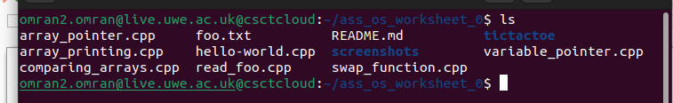

---

## 3.2 Compiling the "Hello World" program

clang -o hello hello-world.cpp

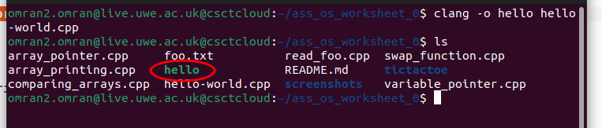

---

## 3.3 Running the program

./hello

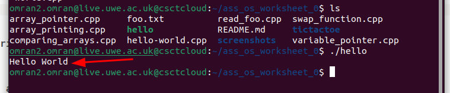

**Output:**  
`Hello World`  
This confirms that the compiler and execution environment work correctly.

---

# 4. Task 1 — Pointers, Arrays, File Reading, Swapping, and 2D Arrays

Worksheet 0 includes several C programs demonstrating fundamental concepts important for later OS-level work.

---

## 4.1 Navigating the worksheet directory

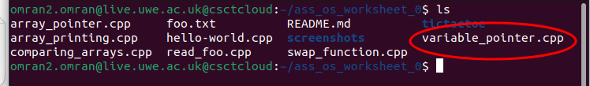

---

## 4.2 Pointer to a Local Variable (`variable_pointer.cpp`)

### Objective  
Use a pointer to increment the value of a variable.

### Build

clang -o variable_pointer variable_pointer.cpp

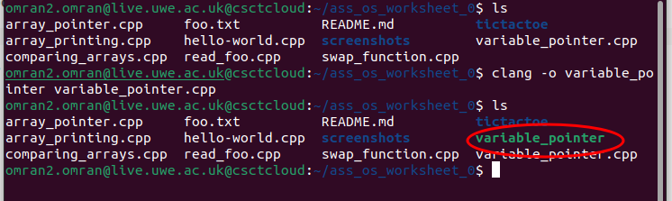

### Run

./variable_pointer

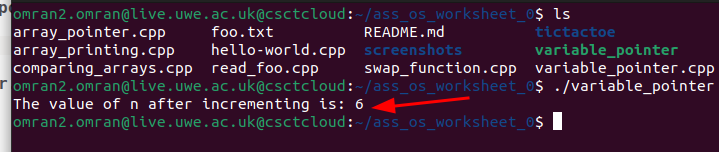

**Output Explanation:**  
The program increments an integer via a pointer, demonstrating indirect modification of a variable's value.

---

## 4.3 Array Pointer Demonstration (`array_pointer.cpp`)

### Objective  
Use a pointer to traverse an array and print:

- Values  
- Addresses  

### Build

clang -o array_pointer array_pointer.cpp

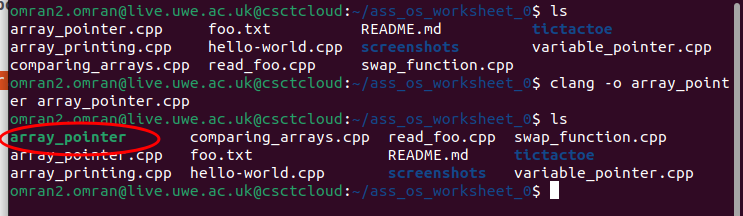

### Run

./array_pointer

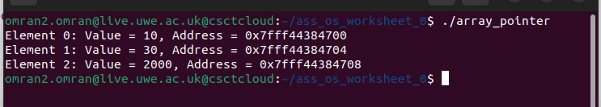

**Output Explanation:**  
Each element is shown with its memory address, confirming that pointer arithmetic increases addresses by `sizeof(int)` (typically 4 bytes).

---

## 4.4 Reading From a File (`read_foo.cpp`)

### Objective  
Read numbers from `foo.txt` and compute their sum.

### Build

clang -o read_foo read_foo.cpp

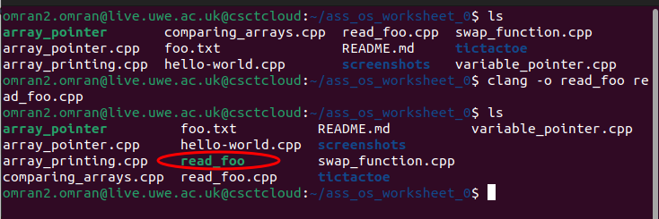

**File contents (`foo.txt`):**

10
20
30
40
54

The program reads these values, adds them, and prints the total.

---

## 4.5 Swap Function Using `void*` (`swap_function.cpp`)

### Objective  
Implement a generic swap function using pointer casting.

### Build

clang -o swap_function swap_function.cpp

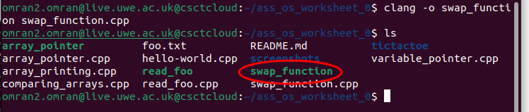

### Run

./swap_function

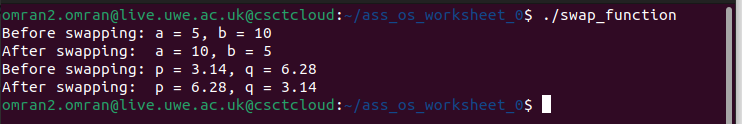

**Output Explanation:**  
The program swaps both integers and floating-point values, confirming proper use of void pointers and memory copying.

---

## 4.6 Printing a 2D Array (`array_printing.cpp`)

### Objective  
Use a 1D pointer to print a 2D array in row-major order.

### Build

clang -o array_printing array_printing.cpp

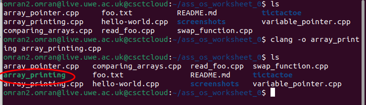

### Run

./array_printing

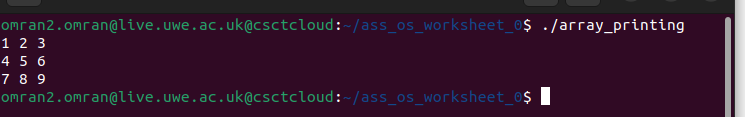

**Output Explanation:**  
The program prints a 3×3 matrix using pointer indexing (`*(arr + index)`), demonstrating understanding of memory layout.

---

# 5. Task 2 — Tic-Tac-Toe Game (Multi-File C Project)

The Tic-Tac-Toe project applies:

- Modular C programming  
- Header files for shared declarations  
- Pointer-based manipulation of board state  
- Input validation  
- Simple turn-taking game logic  

Source modules:

main.c

game_logic.c / game_logic.h

utils.c / utils.h

---

## 5.1 Navigating to the Tic-Tac-Toe folder

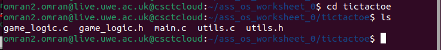

---

## 5.2 Compiling the game

gcc main.c game_logic.c utils.c -o tictactoe

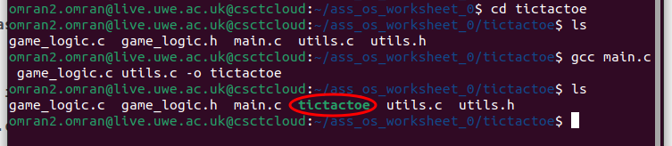

This builds the complete game into an executable named **tictactoe**.

---

## 5.3 Running the game

The following screenshots show different stages of execution.

### Game Start + Index Guide

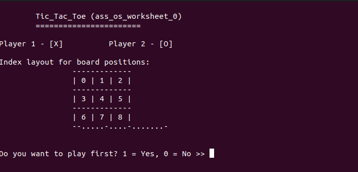

---

### Mid-game state (board updated after player and computer moves)

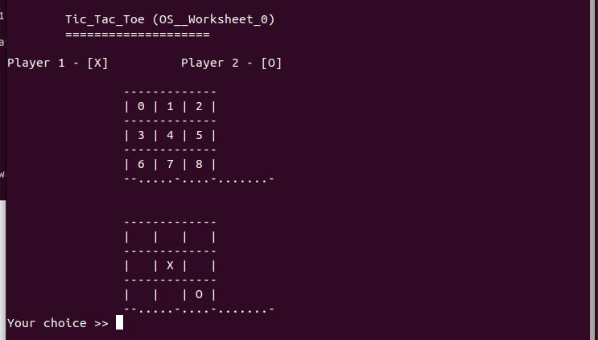

---

### End-game: Computer wins

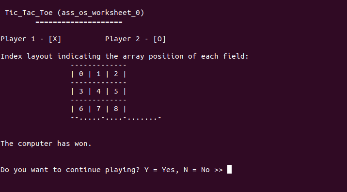

---

# 6. Design Decisions & Rationale

### uses of pointer in programs
Pointers and memory manipulation are essential skills for:

- Writing assembler in later worksheets  
- Implementing OS components such as memory managers, kernels, and buffers  

These early exercises ensure we understand:
- Indirection  
- Pointer arithmetic  
- Manual memory access patterns  

### The modular Tic-Tac-Toe game

- Multiple modules  
- Header files  
- Linked compilation  
- Clean separation between logic and UI  

### Why we use `clang` and `gcc`?
Both are widely used in systems programming:

- `clang` for C++ and portability  
- `gcc` for standard C compilation  

---

# 7. Conclusion

This worksheet demonstrates proficiency in core C programming concepts:

- Pointers and memory addressing  
- Array traversal  
- File input  
- Generic functions using `void*`  
- 2D data representation  
- Multi-file program structure  
- Implementing a functional console game  

All tasks were successfully completed and validated through the screenshots included.

---

**End of README.md**
